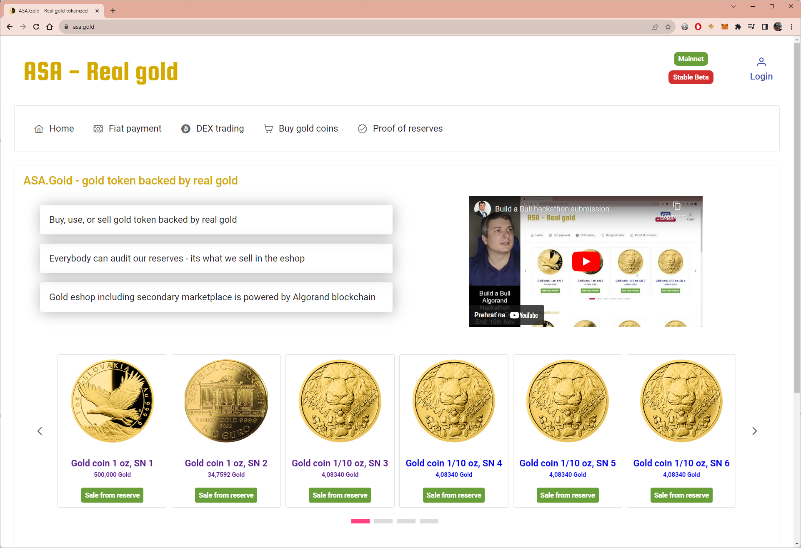
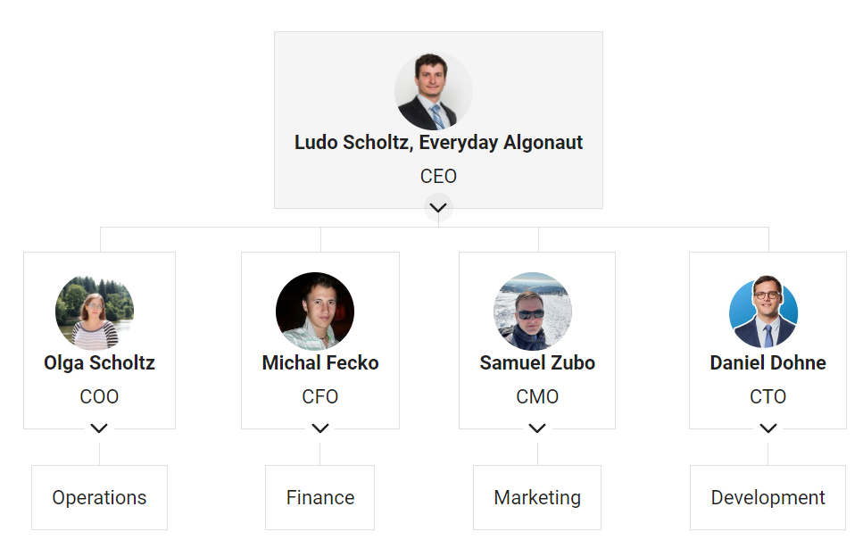

# ASA.Gold - Gold token backed by real gold

Project has been initiated by and submitted to Algorand's Build a Bull hackathon.

## Progress we have made so far

- Oct 19th 2023 : Web2 Authentication Experience - We created algorand-authentication-component-vue component free for use for anybody.
- Oct 21st 2023 : Domain has been registered
- Oct 26th 2023 : We have integrated Folks Router for swapping Gold to Algorand, USDC and BTC and vice versa
- Nov 1st 2023 : We have integrated email templates, and on email verification we airdop some algos so that web2 users have even better xp
- Nov 5th 2023 : Smart contract has been finished with full test coverage
- Nov 6th 2023 : ASA.Gold NPM package has been published
- Nov 12th 2023 : Eshop is working including secondary marketplace
- Nov 13th 2023 : Testnet launched at https://testnet.asa.gold/
- Nov 14th 2023 : Mainnet launched at https://www.asa.gold/. Gold token has been minted: Gold: 1241944285, and DAO governance token has been minted: GoldDAO: 1241945177 . Tokens verified by Pera.
- Nov 15th 2023 : Mainnet liquidity launched at pact.fi pools with $10k TVL of gold token and $6k TVL of GoldDAO token

## Check our open source progress

- FE: https://github.com/scholtz/gold-asa-frontend
- BFF: https://github.com/scholtz/AsaGoldBff
- RepoApi: https://github.com/scholtz/AsaGoldRepository
- EShop smart contract: https://github.com/scholtz/gold-asa-frontend/tree/main/asa-gold-smartcontract
- AuthComponent: https://github.com/scholtz/algorand-authentication-component-vue
- NPM package: https://www.npmjs.com/package/algorand-asa-gold

## Smart contract

## Team

- Team leader: Ludovit Scholtz, Based in Prague

Relay node runner, founder of the vote coin project, AWallet, and big algorand maximalist.

- COO: Olga Scholtz, Based in Prague

Olga have experience in management and business operation.

- CFO: Michal Fečko, Based in Switzerland

Mike is commodities trader with interest in energy markets and gold.

- CMO: Samuel Zubo, Based in Prague

Samo is owner of multiple eshops and knows the best marketing strategies to sell the products online.

- CTO: Daniel Dohne, Based in Switzerland

Daniel is expert in multiple blockchain technologies and is CEO of Aramid.Finace - bridge between algorand, near, polygon, aurora, and ETH.

## Product Market Fit

Even though we launch the project under MiCA regulation within EU boundaries, the holders of gold token may be any algorand user worldwide.

Target audience of the gold token are:

- Small investors who want to invest into gold on periodic basis
- Large investors who want to hedge their portfolios
- Projects which wants to have their token to be backed by real gold, for example https://stabilitas.finance
- Eshop owners who want to utilize algorand's efficient blockchain, but do not want to use volatile asset
- Restaurants who want to allow their customers to pay with gold
- Undeveloped countries with high inflation

Our revenue stream is from the Onramp solution which combines bank world with crypto world, and real gold coins eshop sale to public, and market inetrventions.

We have launched a DAO governance token with stable price peg to USD, which may allow further financing.
