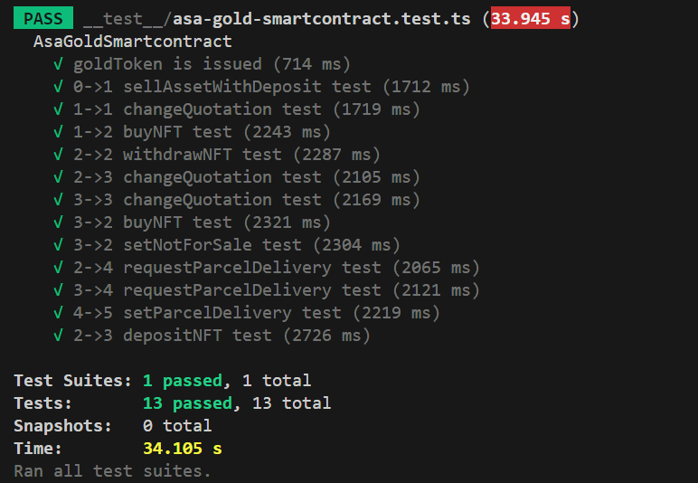

# ASA.Gold smart contract

- Vault owner can mint new NFT and put it on sale for the gold token. [State 1]
- When user buys the NFT, he can withdraw it to his own account and sell at other marketplace, or he can select price for secondary marketplace [State 3]
- Owner of the NFT can request parcel delivery [State 4] and when it is in the shipping the vault owner marks the delivery to be in process [State 5]

https://www.asa.gold

For tests its recommended to run sandbox in dev mode `sandbox up dev`. (Faster block times)

Run tests with `npm run test`
